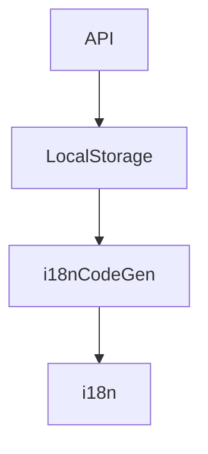

# simplyfirescore

Base Assets and Sample Architecure implementation for all Simples Projects

## Getting Started

The exported assets of the project will ONLY

[Base]
  abstract repository
  abstract entity
  abstract model
  simples_widgets - baseWidgets

  repositoryImpl

  values - themes, styles

[Helpers]
    i18n
    validation
    logger
    simplesCall

[Services]
  firebase
    *firestore
    *firestorage
    *authentication
    fcm
    *functions
  *api_service
  websocket
  localStorage
  localdbHive
  securestorageservice
  sqliteService
  android_platform_service
  tts-text-to-speech
  speech-to-text
  voipcalls
  carriercalls
  sms-service
  webrtcConference
  transliterate_service
  auto_complete
  

All these will be implementables / extendables / referrables.

[config, routes, main, materialApp] in this project will be 
just a reference to refer their structure to implement in other projects.

Each project can have a MaterialApp with routing for internal testing
The implementor project will manage the routing with MaterialApp

current:

